# IOT-project-remote-car

This repository contains the code for my project from the course "Applied IOT - 1DT305".
The project is a robot car controlled remotely through WiFi.

## Tutorial

| **Name**        | **Credentials** | **Date**        |
|-----------------|-----------------|-----------------|
| Artur Gasparyan |    ag223pe      | 09 August 2022  |

This section will explain how to replicate the project as well as elaborate on the system along with the corresponding design decisions. Some sections might be poorly ordered because the tutorial follows a strict template for the assignment, so one might need to skim the content before diving in further.

The end goal of the project is to create a remote robot that can autonomously navigate in an environment given a desired destination.
To this goal, the work up to this point can be seen as a subgoal.
To create a mobile robot, one must first remotely control actuators and sensors over a network.

In this project, a robot car was programmed to communicate with a server over a WiFi connection.
This server then communicates with a website over an additional server, which serves as the interface between human and robot.
From this interface, a user can control the motors of the robot, and see the sensor values, which get broadcasted from the robot to the server.

Due to my inexperience with IoT and embedded systems, this project took a considerable amount of time; roughly 100 hours.
Much of this time was spent debugging external libraries which, as it turns out, have some slight incompatibilities with the hardware I selected.
Regardless, the result is mostly functional in the sense that most remaining faults are known limitations within the scope of the project.

### Objective

When given the choice as to which project one should select, one should select the coolest one.
After all, if the self-chosen projects are not cool, which ones will be?
To this end, few areas fulfill the criteria better than the subject of autonomous robots.
The idea of creating a device that can eliminate all forms of labor, mental and physical, can be seen as a holy grail for engineers, as it would be the last problem one would ever need to solve.
Naturally, this project does not solve that problem.
Regardless, the fact remains that autonomous robots are cool, and therefore a good choice for a project.

The purpose of this project is to create a remote-controlled robot, which can then be improved upon in further work.
It is meant to provide a mix of educational moments to learn IoT development, as well as a basis for future projects more tailored toward robotics.

In practice, I believe the project provides the experience needed to do hobby projects in the field of mobile robotics.
Because the focus is on learning and gaining knowledge, the goal is therefore not to create a viable product to deploy but to simply gain the practical experience of creating a working system.

### Material

The core of the robot was made using an ESP32-WROVER, due to the low cost, WiFi compatibility, and camera integration.
Along with the board came a plethora of peripherals and accessories, such as a motor driver and an attitude sensor (gyroscope and accelerometer).
All of this was purchased together in a kit called *Freenove Ultimate Starter Kit for ESP32*, which can be found on Amazon using [this](https://www.amazon.se/gp/product/B08FM2NCST/ref=ppx_yo_dt_b_asin_title_o00_s00?ie=UTF8&psc=1) link (499kr).

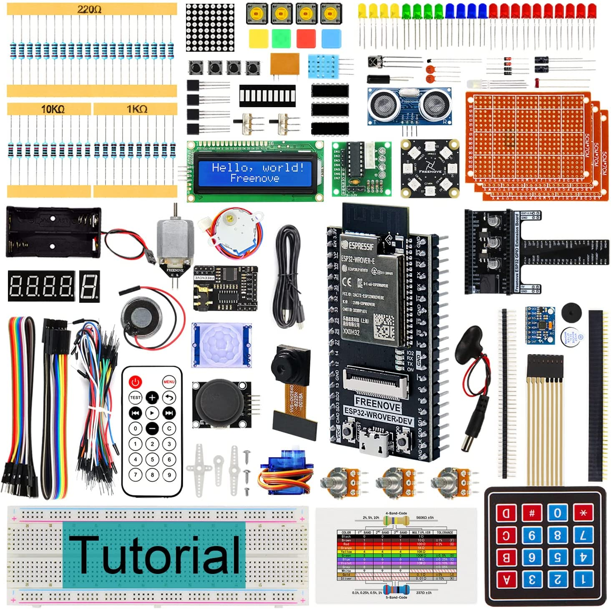

The components of the car were purchased separately in a robot car kit, found on Kjell & Company using [this](https://www.kjell.com/se/produkter/el-verktyg/arduino/arduino-tillbehor/robotbyggsats-med-hjul-och-motor-p87065) link (299kr).

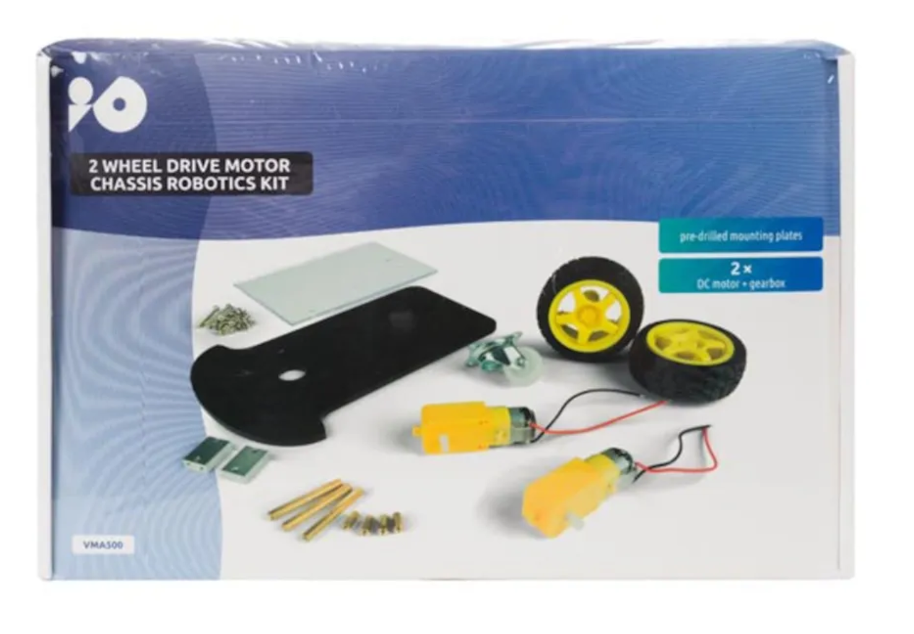

To connect the motor wire to the GPIO pins on the breadboard, an additional piece of solid-core AWG20 wire was soldered onto each one.
This wire was bought from Electrokit using [this](https://www.electrokit.com/produkt/kopplingstrad-awg20-entradig-svart-m) link (2 x 15kr).

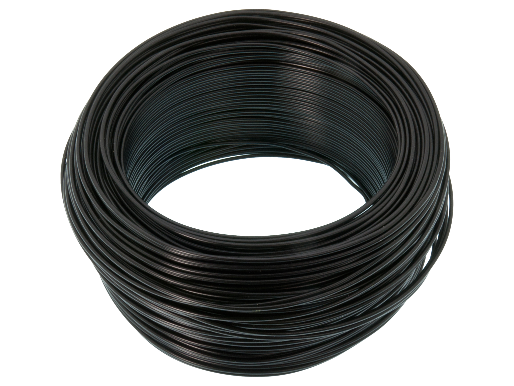

### Computer setup

The setup was divided into three parts, one for each subsystem.

#### **Robot**

Because the project was done using an ESP32, the choice of platforms was native ESP32, Arduino, and MicroPython.
Since I was somewhat inexperienced with embedded development, I decided to go with the option that had the largest online community, which I determined to be the Arduino platform.

Because I needed to work on the other systems which use different programming languages, I decided to use Visual Studio Code instead of the classical Arduino IDe.
Visual Studio Code has a plugin called PlatformIO which provides many practical tools for embedded development.
Since I had previous experience with C++ and Visual Studio Code, I was fine with the added complexity of PlatformIO for the benefits.
Because of PlatformIO, uploading the code and monitoring to the device and monitoring the serial output is done from VSCode with the click of a button.

Throughout the project, I ended up installing two additional libraries for the Arduino platform.
The first one was [ArduinoWebsockets by gilmaimon](https://github.com/gilmaimon/ArduinoWebsockets), which allows somewhat smooth communication across a web socket for the ESP32.
The second library was [mpu6050 by ElectroCats](https://github.com/ElectronicCats/mpu6050), which simplifies reading sensor values for the attitude sensor.
Unfortunately, the second library has some slight incompatibilities with the ESP32 device, so I had to manually implement the changes described in [this blog post by Frank](https://www.fpaynter.com/2019/10/mpu6050-fifo-buffer-management-study/) (which I figured out as a result of weeks of debugging).

#### **Server**

The server is implemented in Python, version 3.10.
It uses the [websockets library by aaugustin](https://pypi.org/project/websockets/), which provides fairly advanced functionality for asynchronous web socket communication.
Because Python is an interpreted language, it does not need to be recompiled.
Thus, any change in the code can be viewed by simply restarting the code.

#### **Interface**

Frontend communication is done using a classic website, which communicates with the Python server over a web socket.
It is implemented with vanilla JavaScript, though minified using Watchify.
Watchify also provides watch mode, which means that any change in the code is directly displayed in the browser.
Thus, to develop the frontend, one needs to install:

* Node.js - Requirement for npm

* npm - Package manager

* Watchify - To manage proper file management and code management

* Chart.js - Library for displaying charts with JavaScript

* http-server - Run the website on the local network

#### **Workflow**

To keep the different components of the project completely separated from each other, three different VSCode windows were used during development, one for each subsystem.
In each window, a terminal was used for the specific component, which is illustrated in the following table:

| System | Function |
| -- | -- |
| Robot | Displaying serial monitor and uploading code
| Server | Running the server and displaying debug messages
| Interface | Running watch mode with Watchify

Besides this, a separate console was used to run the HTTP server that connects the web page to the local network.
This web page was then displayed in the browser.
An image showing the workflow can be seen in the following image:

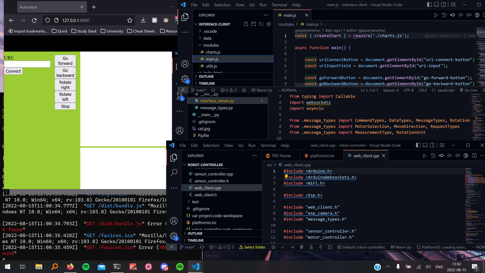

### Putting everything together

Due to the robot simply consisting of an ESP32, a sensor, a motor driver, and two DC motors, the wiring was fairly straightforward.
However, despite the simplicity of the wiring, the overall number of wires grew to be quite large.
To keep the image uncluttered, the diagram will exclude the wires and only illustrate where each pin can be found.
The wiring itself will be included as a table that maps the pins of each component to the pins on the ESP32.

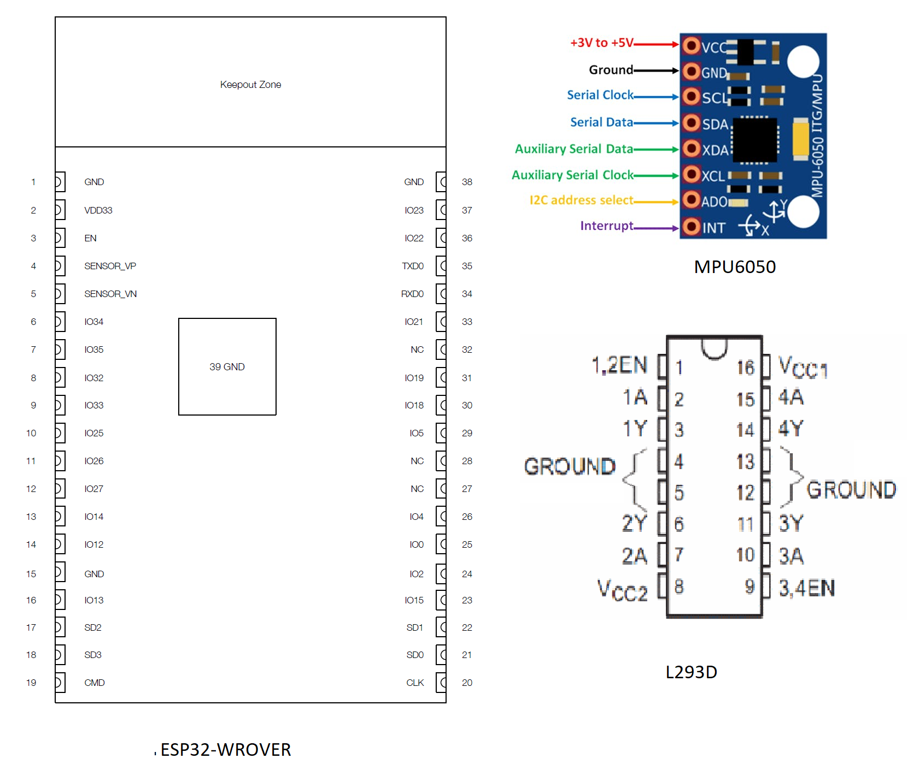

| component | microcontroller |
| --| -- |
| | |
| **MPU6050** | |
| SCL | GPIO22 |
| SDA | GPIO21 |
| GND | GND |
| VCC | 5V |
| INT | GPIO15 |
| | |
| **L293D** | |
| 1,2EN | 5V |
| 1A | GPIO26 |
| 1Y | MOTOR_L_NEG |
| GND | GND |
| GND | GND |
| 2Y | MOTOR_L_POS |
| 2A | GPIO27 |
| VCC2 | 5V |
| VCC1 | 5V |
| 4A | GPIO19 |
| 4Y | MOTOR_R_POS |
| GND | GND |
| GND | GND |
| 3Y | MOTOR_R_NEG |
| 3A | GPIO18 |
| 3,4EN | 5V |
| | |
| **MOTOR_L** ||
| POS | L203D_2Y |
| NEG | GND |
| | |
| **MOTOR_R** ||
| POS | L203D_4Y |
| NEG | GND |

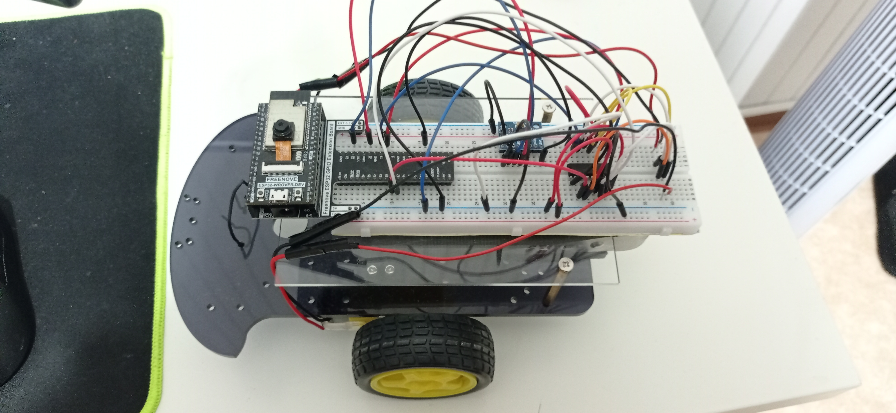

As one can see, the wiring is messy and cumbersome.
This is because the robot is a prototype optimized for rapid development and experimentation.
If one needs to create a robot for practical use, more focus should be put on creating tight wiring, ideally beneath the glass sheet instead of above it.
One possible option could be to use a solder board instead of a breadboard, with the components being densely placed.

An additional unpracticality of the current design is that the weight is poorly distributed, resuling in the robot being back heavy.
Because of this, a counter weight has been placed inside of the robot, but this adds additional weight and therefore unncessary power consumption.

### Platform

The project is entirely locally hosted over a WiFi network.
Because it is a robotics project, most control and interaction occurs realtime.
Hosting the project locally ensures full control over the various components and makes further development relatively seamless.

### The code

There is too much code to explain in detail here, so it will be described in high level.
For more details, see the source code in this repository.

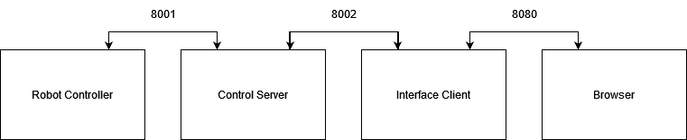

#### **Robot Controller**

Since the platform for the robot is Arduino-based, the code is formed after the classical Arduino workflow.
That is, first an initilization routine is defined follow by a mainloop that will continously run as long as the device is powered.

The initilization routine does the following things:

* Connect to WiFi on the given IP address.

* Connect to the control server's web socket on port 8001.

* Initialize the attitude sensor.

* Intialize the motors.

The mainloop does roughly the following:

* Update the sensor values.

* Handle any received message from the control server using a callback.

* Send the sensor values to the control server.

#### **Control Server**

The control server is responsible for maintaining two web sockets at the same time.
Because the websockets library previously mentioned is asynchronous, one cannot send and receive messages at the same time in order to avoid potential conflicts.
Therefore, one could not simply pass a message from the control server to the interface client and viceversa.
This was resolved by storing all messages to be sent in a socalled "messagebox".
For each connection, a "handler" was then created, which sent all messages in the message box before receiving any incoming ones.
The following pseudocode illustrates the logic for a handler:

    while socket is open:
        for each message in messagebox:
            remove message from messagebox
            send message

        wait for incoming message
        handle incoming message

#### **Interface client**

A fairly simple set of buttons and fields.
After entering the IP address and connectiong, a web socket is opened with the given address on port 8002.

The most advanced functionality is the chart which displays sensor values.
It stores a list which is 10000 long, each element representing a value at the given millisecond.
When receiving a value outside of the time bounds of the list, it clears itself and starts representing the new time bound.
This is illustrated in the following pseudocode:

    if time < base or time > base + 10000
        clear measurements
        base := time floored to lowest multiple of 10000

    add measurment to measurements at time

### Transmitting the data / connectivity

As previously mentioned, the project uses local WiFi as the wireless protocol.
This is because the robotics project requires realtime streaming of data over a relatively short distance, which is what WiFi excells at.
Further work might require video streaming, in which case the high data load would render something like LoRa unfeasable.

Another requirement is multiway-way communication.
That is, the robot controller can send messages to the interface, and vice-versa.
This differs from HTTP-based protocols like Webhook, since their communication is server-client-based.
Because of this, the WebSocket protocol was chosen.

Each packet is formatted as a bitstring, with each bit representing a type.
This means that each contains 255 potential types.
While that does seem redundant, it allows for the flexibility of always adding types throughout development without worrying about running out of bits.

The pattern can be seen as follows:

    0   1   2   4   5
    request
        data
            image
            measurement
                rotation
                    quaternions
                    radians
                    degrees
                acceleration
                    raw
                    relative
                    world
                gravity
    status
    data
        image
        measurmenet
            rotation
                quaternions
                radians
                degrees
            acceleration
                raw
                relative
                world
            gravity
    command
        move
            first
                none
                forward
                backward
            second
                none
                forward
                backward
            firstAndSecond
                none
                forward
                backward
        rotate
            right
            left

### Presenting the data

The resulting dashboard can be seen in the following image:

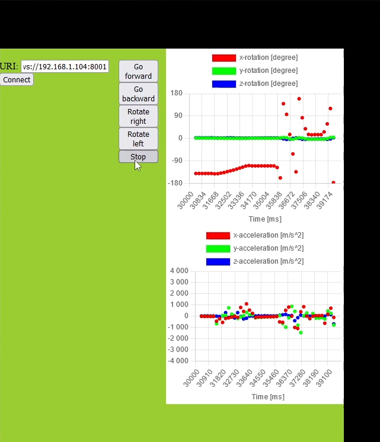

As one can see, the robot sends sensor measurements about 10 times per second.
These measurements then get stored in a 10 second interval, afterwhich they get erased.
This is because the measurments are simply used for the graph in the current moment.
If one was to use them for more advanced purposes, such as data analysis and machine learning, they could be stored either locally or in a database.

### Finalizing the design

Here is a video demonstration where I display the current functionality of the project.

... YOUTUBE ....

As one can see, the messaging has a tendency of being unstable.
One pattern I've noticed is the control server sometimes bugging out and starting to send junk values to the ESP32.
I'm not quite sure what causes it, but I know that restarting the whole setup makes it work again.

Another issue is that fact that the robot continues despite losing the connection.
This is obviously a safety hazard and needs to be fixed.
One possible fix would be to stop the motor after 500ms.
The control server would then periodically repeat the signal until the interface gave a different instruction.

Overall, the project turned out quite well.
It needs refinement in order to actually be usable, but as a prototype it serves it's purpose.

Finally, here are some pictures of the robot:

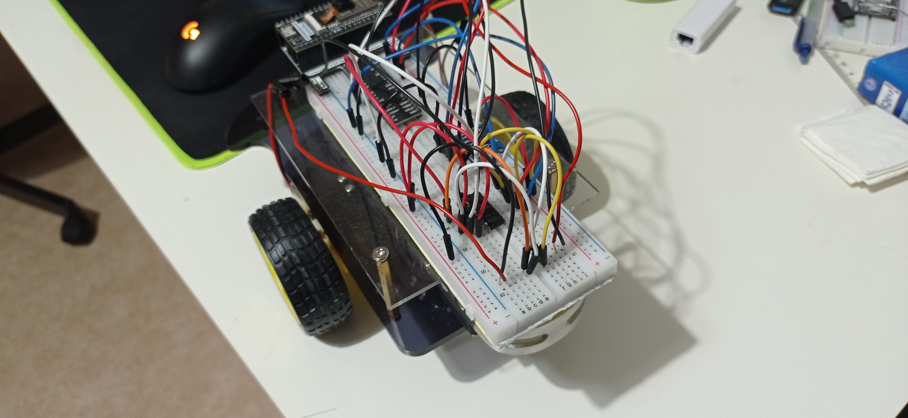
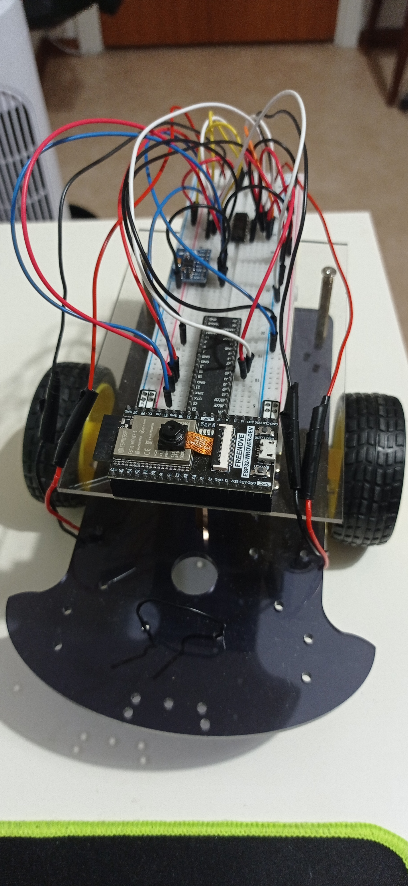
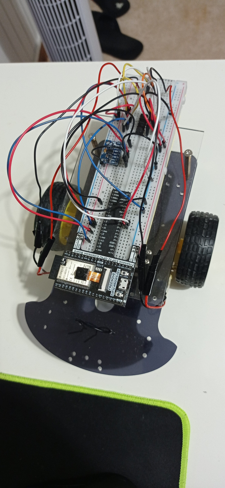